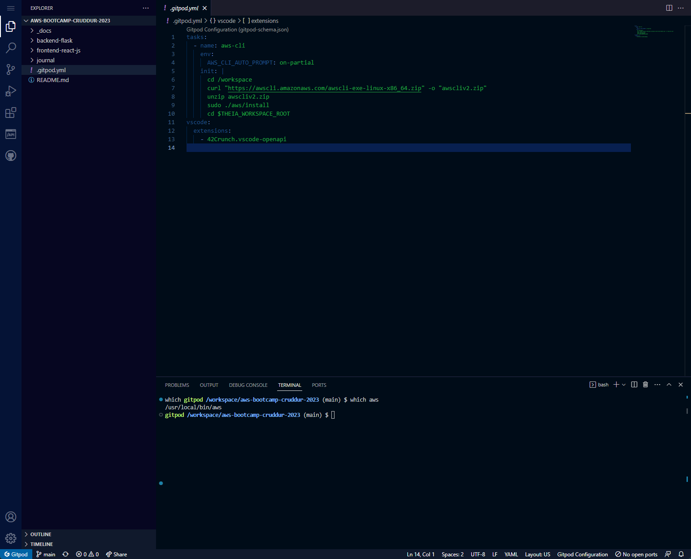

# Week 0 — Billing and Architecture

## Homework Assignments:

- [x] Watched Week 0 - Live Streamed Video
- [x] Watched Chirag's Week 0 - Spend Considerations
- [x] Watched Ashish's Week 0 - Security Considerations
- [x] Recreate Conceptual Diagram in Lucid Charts or on a Napkin
- [x] Recreate Logical Architectual Diagram in Lucid charts
- [x] Create an Admin User
- [x] Use CloudShell
- [x] Installed AWS CLI
- [x] Generate AWS credentials
- [x] Create a Billing Alarm
- [x] Create a Budget

## Homework Challenges:

- [x] Destroy your root account credentials, Set MFA, IAM role
- [ ] Use Eventbridge to hookup health dashboard to sns and send notification when there is a service health issue.
- [x] Review all the questions of each pillar in the well architected tool (no specialized lens)
- [ ] Create an architectural diagram (to the best of your ability) the ci/cd logical pipeline in lucid charts
- [ ] Research the technical and service limits of specific services and how they could impact the technical path for technical flexibility.
- [ ] Open a support ticket and request a service limit

## Proof of Work:

### User creation

- First I created a new IAM user for myself and gave it access to the billing console. I did this by signing in on my root user and going to the IAM section, I created a new user and then made a new policy that is only for IAM/Billing. I then restricted that access to having MFA set up as well using the same policy.
  - 
  - 

### Billing alert creation

- I then went into the cloudwatch management console, after adding that as a permission to my IAM user.
- I created a billing alarm so I could be alerted anytime the bill exceeds 1 it will email my personal email.
- I then went into the budgets section and created a zero spend budget
  - 

### Lucid Charts

- I made my conceptual diagram [here](https://lucid.app/lucidchart/cd783c5c-0d8d-4a40-bd7d-73354b24d076/edit?viewport_loc=-354%2C-272%2C2272%2C1961%2C0_0&invitationId=inv_0084f3d1-04eb-457b-9a04-bd5475d142c8)
  - 
- And my logical diagram [here](https://lucid.app/lucidchart/37726de4-a2f9-4016-bbb7-5567e5444b58/edit?viewport_loc=2%2C98%2C1561%2C1278%2C0_0&invitationId=inv_9d71a71f-0c59-4efb-b6b5-49786be43256)
  - 

### GitPod

- I set up my gitpod container with a task to install the aws cli tool
- I confirmed it all worked and that the aws tool exists in the path
  - 
- I set up my env variables scoped to the repo
  - 
